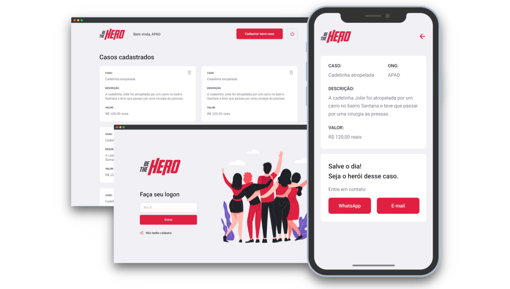

<p align="center">
  
</p>

<p align="center">
  

  
  
  <a href="https://github.com/ezequielcsilva/be-the-hero/commits/master">
    
  </a>

  <a href="https://github.com/ezequielcsilva/be-the-hero/issues">
    
  </a>

  
</p>

<p align="center">
  App to help NGOs built with ReactJS, React Native, Node.js and more. 
</p>



## About this Project

#### Web

The web page will be used to register the NGO, where you will receive an ID for access. Subsequently, cases will be registered on the profile page.

#### App

In the application will be listed all the cases registered by the NGOs, where you will have WhatsApp and E-mail so that the user can contribute with the case by contacting the responsible person directly.

## Why?

BeTheHero is a project that aims to connect people who want to make monetary
contributions to NGOs (non-governmental organizations) that need help.

## Tech

- [NodeJs](https://nodejs.org/en/) - Build the server
- [ReactJs](https://reactjs.org) - A JavaScript library for building user interfaces
- [React Native](https://reactnative.dev) - Native Development
- [Expo](https://expo.io) - Deploy and quickly iterate on native Android, iOS, and web apps
- [SQLite3](https://www.sqlite.org) - DB Connector
- [Express](https://expressjs.com/) - Router of the Application
- [KnexJs](http://knexjs.org) - SQL query builder for Postgres, MSSQL, MySQL, MariaDB, SQLite3, Oracle, and Amazon Redshift
- [Celebrate](https://github.com/arb/celebrate) - A joi validation middleware for Express.
- [CORS](https://www.npmjs.com/package/cors) - Cross-origin Resource Sharing
- [Axios](https://github.com/axios/axios) - Promise based HTTP client for the browser and NodeJs
- [Jest](https://jestjs.io) - Jest is a JavaScript testing framework maintained by Facebook
- [Supertest](https://github.com/visionmedia/supertest) - Super-agent driven library for testing node.js HTTP servers
- [Prettier](https://prettier.io/docs/en/cli.html) - An opinionated code formatter
- [ESlint](https://eslint.org) - ESLint statically analyzes your code to quickly find problems.

## Development setup

### Prerequisites

To run this project in the development mode, you'll need to have a basic environment with NodeJs and Expo CLI installed.

**Cloning the Repository**

```git
git clone https://github.com/fariasmateuss/be-the-hero.git
```

### Installing

#### Back-End

Run `yarn` in the `backend` folder;

Run `yarn start` to up the server;

Open Insomnia or Postman and import the Insomnia.json workspace file at backend folder.

#### Front-End

Run `yarn` in the `frontend` folder;

Run `yarn start` to up the project;

#### Mobile

Run `yarn` in the `mobile` folder

Update the baseURL at src/services/api.js.

Run `expo start` to up the project.

#### Test

Run `yarn test:backend` at the backend folder;

#### Migrations

Update the database

```
knex migrate:latest
```

To rollback all the completed migrations:

```
yarn migrate:rollback
```

To run the next migration that has not yet been run

```
knex migrate:up
```

To undo the last migration that was run

```
knex migrate:down
```

# License

[MIT License](/LICENSE)
